<p align="center">
  
</p>

<h1 align="center">
    <a href="https://git.io/typing-svg"></a>
</h1>

## Table of Contents

- [Introduction](#introduction)
- [Tech Stack](#Tech-Stack)
- [Features](#features)
- [Requirements](#requirements)
- [Instalation](#instalation)
- [Create Environment Variable](#create-environment-variable)
- [Screenshots](#screenshots)
- [Release Demo](#Demo)
- [Related Project](#related-project-backend)
- [Developed](#Developed)
- [License](#License)
- [Contact](#Contact)


## introduction

I served as a Fullstack Web Developer in the development of Peworld, an innovative Android application focused on job search and recruiting. Peworld makes it easy for users to post personal data and portfolio information to search for work or recruit, with full integration to the Peworld website. What is unique about this application is its ability to provide real-time notifications to users when new recruitment or registration occurs, ensuring users never miss important opportunities.


## Tech Stack

**Programming language:** JavaScript (React Native)

**HTTP Client:** Axios

[](https://skillicons.dev)


## Features

✨ Add portfolio : Users can post their portfolios to attract recruiters' attention.

✨ Update personal data & portfolio : Allows users to update their personal and portfolio information.

✨ Delete skill : Feature to delete irrelevant or unused skills

✨Upload & update profile image : Users can upload and update directly by Camera or File manager of their profile picture to strengthen personal branding

✨ Post personal data : Users can post their complete personal data for recruiters to see

✨ Worker Search : Recruiters can search for workers based on certain criteria to facilitate the recruitment process


## Requirements

- [`npm`](https://www.npmjs.com/get-npm)
- [`React-native`](https://reactnative.dev/docs/getting-started)
- [`Axios`](https://axios-http.com/docs/intro)
- [`Backend Peworld`](https://github.com/crossxjonathan/peworld-backend)


## Instalation
- [`React-native`](https://reactnative.dev/docs/environment-setup)

#### Clone this repository

```bash
   git clone https://github.com/crossxjonathan/hirejob-mobile.git
```

#### Install Depedencies

```bash
   npm install
```

#### Start Project

```bash
   npm run dev
```


## Create Environment Variable

If you want to run this environment, you need to add the following environment variables to your .env file

setup server: 

`API_URL`

## Screenshots

<div align="center">
    <p>Login Page</p>   
    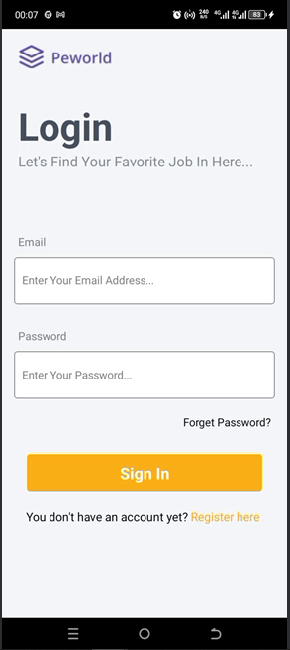   
    <p>Register Page</p>   
    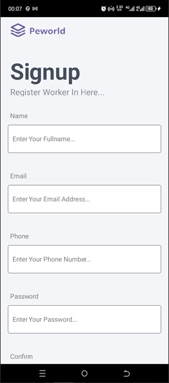   
    <p>Landing Page</p>   
    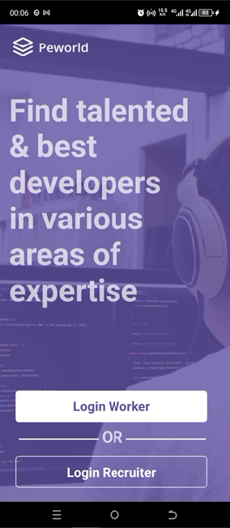
    <p>Splash Screen</p>   
    
</div>
<div align="center" style="display: flex; flex-direction: column; align-items: center; margin: 20px;">
    <p>Home</p>   
    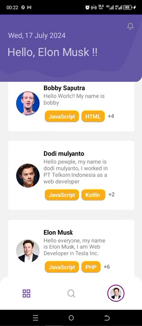   
    <p>Profile Worker</p>   
    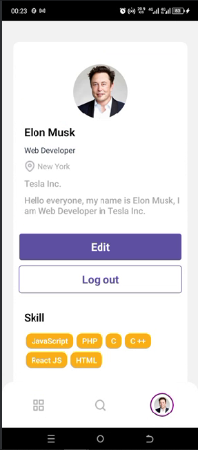   
    <p>Portfolio</p>   
    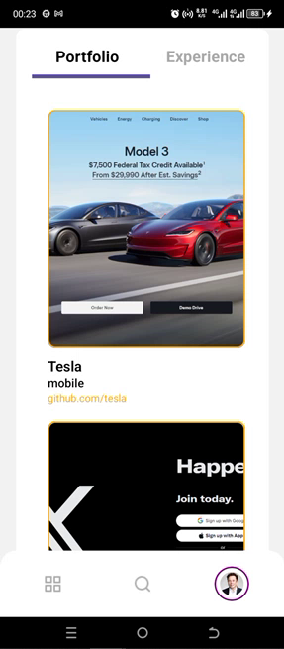
    <p>Experience</p>   
    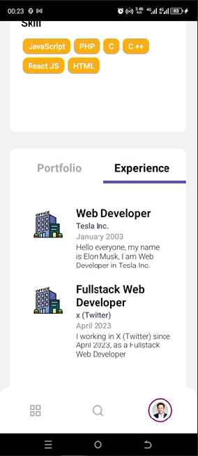   
    <p>Edit Personal Worker</p>   
    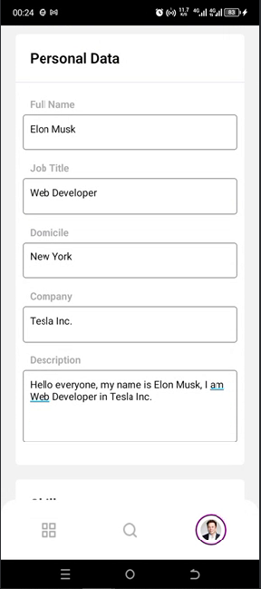   
    <p>Edit Skill & Experience Worker</p>   
    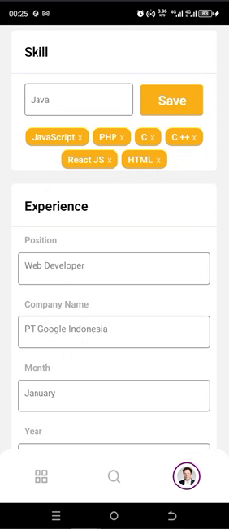
       
     <p>Edit Portfolio Worker</p>   
    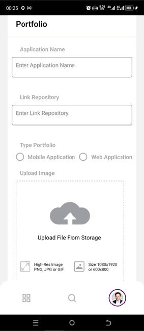
    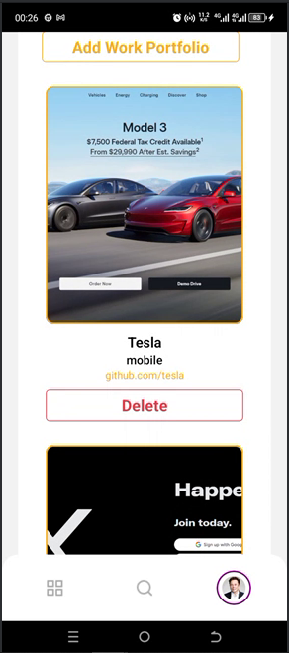 
    <p>Edit Profile Worker</p>   
    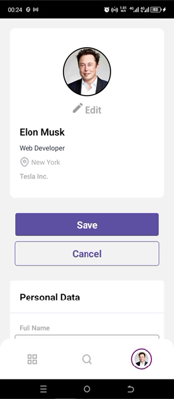  
</div>
<div align="center" style="display: flex; flex-direction: column; align-items: center; margin: 20px;">
    <p>Profile Recruiter</p>   
    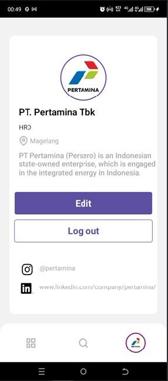   
    <p>Edit Profile Recruiter</p>   
    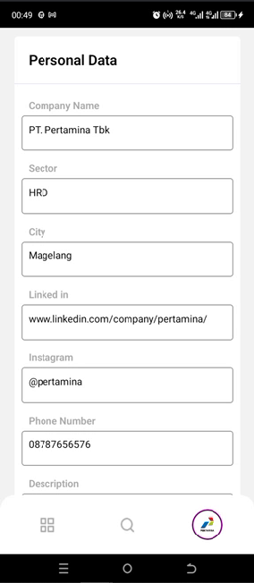   
    <p>Hire</p>    
       
    <p>History</p>    
    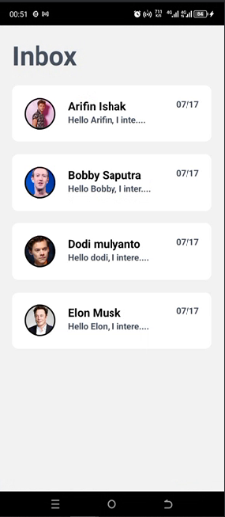   
</div>


## Release Demo
- [`Demo`](https://drive.google.com/drive/folders/1_2DQyy4G83jz9LFf2zeaXjcoRmBE6100?usp=sharing)


## Related Project (Backend)

- [`Backend Peworld`](https://github.com/crossxjonathan/peworld-backend.git)


## Developed :

💻 [@crossxjonathan](https://github.com/crossxjonathan) as FullStack

## License :

-This project is licensed under the MIT License. Please refer to the [LICENSE](./LICENSE) file for further details

## Contact :
📧 firman.jonathan6398@gmail.com
🔗 https://www.linkedin.com/in/firman-jonathan/
